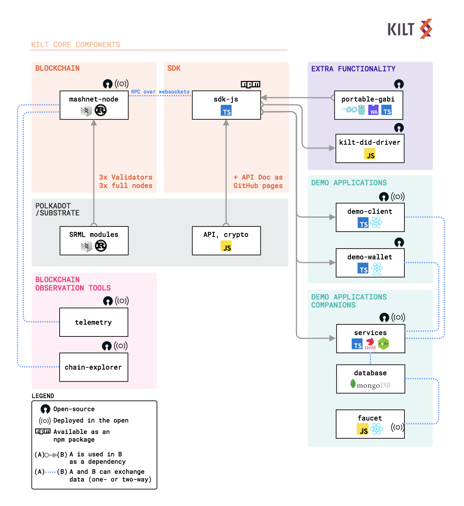
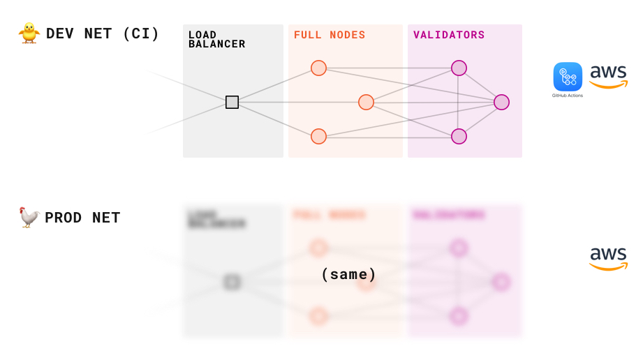

# About KILT

[KILT][website] is an open-source blockchain protocol for issuing self-sovereign verifiable, revocable, anonymous credentials and enabling trust market business models in the Web 3.0.

# Software Overview

```
🐥 = DEV environment
🐓 = PROD environment, stable
```

## Codebases and Dependencies

<p align="center">
  
  <div align="center"><sub><sup>Codebases and Dependencies</sup></sub></div> 
</p>

## Infrastructure / CI

<p align="center">
  
  <div align="center"><sub><sup>Infrastructure</sup></sub></div> 
</p>

## Source code and deployed instances

|                             | WHERE THE CODE IS (OPEN-SOURCE)               | WHERE IT IS DEPLOYED (AWS): DEV ENVIRONMENT🐥 | WHERE IT IS DEPLOYED (AWS): PROD ENVIRONMENT🐓 |
| --------------------------- | --------------------------------------------- | :-------------------------------------------: | :--------------------------------------------: |
| BLOCKCHAIN                  | [mashnet-node][mashnet-node-repo]             |           full-nodes.devnet.kilt.io           |               full-nodes.kilt.io               |
| SDK                         | [sdk-js][sdk-js-repo]                         |                     (not)                     |                     (not)                      |
| DEMO APP                    | [demo-client][demo-client-repo]               |          [demo.devnet][demo.devnet]           |                  [demo][demo]                  |
| DEMO APP                    | [demo-mobile-wallet][demo-mobile-wallet-repo] |                     (not)                     |                     (not)                      |
| DEMO APP COMPANION          | [prototype-services][prototype-services-repo] |            services.devnet.kilt.io            |                services.kilt.io                |
| DEMO APP COMPANION          | [faucet][faucet-repo]                         |        [faucet-devnet][faucet-devnet]         |                [faucet][faucet]                |
| BLOCKCHAIN OBSERVATION TOOL | [telemetry][telemetry-repo]                   |                     (not)                     |             [telemetry][telemetry]             |
| BLOCKCHAIN OBSERVATION TOOL | [polkadot-apps][polkadot-apps-repo]           |                     (not)                     |        [chain-explorer][chain-explorer]        |

# Community

[Community Chat on Riot][cmy-channel]


[cmy-channel]: https://riot.im/app/#/room/#kilt-general:matrix.org
[website]: https://kilt.io
[mashnet-node-repo]: https://github.com/KILTprotocol/mashnet-node
[sdk-js-repo]: https://github.com/KILTprotocol/sdk-js
[demo-client-repo]: https://github.com/KILTprotocol/demo-client
[demo-mobile-wallet-repo]: https://github.com/KILTprotocol/demo-mobile-wallet
[prototype-services-repo]: https://github.com/KILTprotocol/prototype-services
[faucet-repo]: https://github.com/KILTprotocol/faucet
[telemetry-repo]: https://github.com/KILTprotocol/substrate-telemetry
[polkadot-apps-repo]: https://github.com/KILTprotocol/polkadot-apps
[demo.devnet]: https://demo.devnet.kilt.io
[demo]: https://demo.kilt.io
[faucet-devnet]: https://faucet-devnet.kilt.io
[faucet]: https://faucet.kilt.io
[telemetry]: http://telemetry.kilt.io/#/KILT%20Testnet
[chain-explorer]: https://chain-explorer.kilt.io